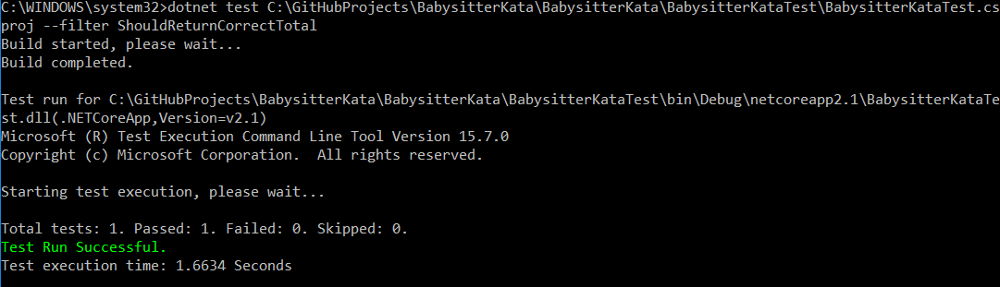

# BabysitterKata

Console application to calculate the cost of a babysitter for the evening! Specify start time, bed time, and the time you will return, and the application will return the cost to you!

# Setup

Clone the repository. If you haven't already, download and install the .NET Core SDK from:

https://www.microsoft.com/net/download

Documentation on using the dotnet CLI can be found at:

https://docs.microsoft.com/en-us/dotnet/core/tools/dotnet?tabs=netcore21

# Run

Open up a command window and use the command dotnet PathToProjectDll:

The application will ask you if you are looking for a babysitter for the evening. type 'y' or 'yes' to continue, 'n' or 'no' to exit.

Enter a valid start time, end time, and bed time. The application will calculate your total cost!

# Test

Open up a command window and use the command dotnet test PathToTestProjectFile:

To see a list of all available tests, append '--list-tests' to the command:

To run a specific test, append --filter NameOfTest to the command:

